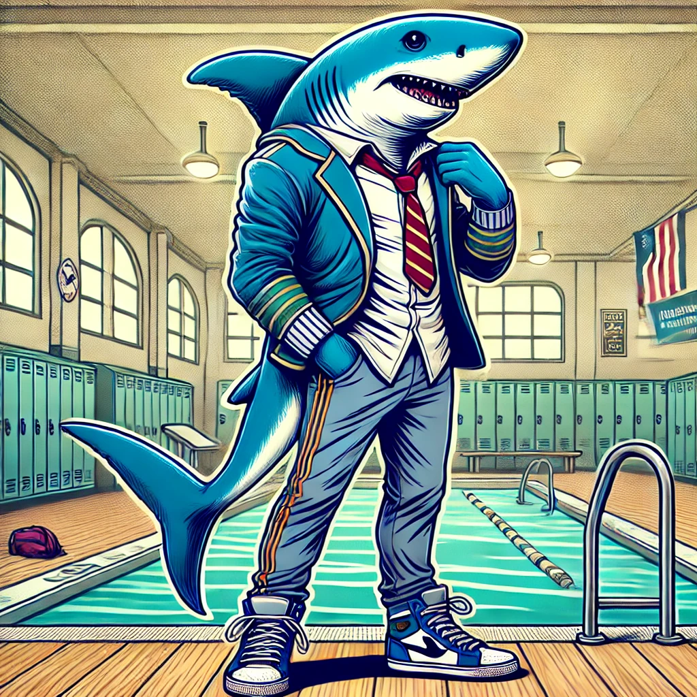

# Boy Shark: The Rogue-like Adventure
## Introduction
Boy Shark: 
- The Rogue-like Adventure is a unique game that combines elements of exploration, puzzle-solving, and rogue-like mechanics. The game follows the story of a young boy who is half shark, navigating through various underwater and above-water environments.

## Story Background
Prologue
- There was a boy who was half shark. Instead of a school backpack, he had a shark fin. Instead of sneakers, he had swim feet. One day during a PE lesson, he swam faster, farther, and better than any other boy. Not because he was half shark, but because he had a good day. During the lesson, he discovered an underwater vent in the school pool. Curious, he ventured through it, leading him down a mysterious path to a lake near the school. This marked the beginning of his extraordinary adventure.

## Characters
### Main Character
Boy Shark

Description
- A young boy who is half shark. He has a shark fin on his back and swim feet instead of regular shoes. Despite his unique appearance, he is just like any other boy, eager to explore and full of curiosity.

Abilities
- Excellent swimmer, can communicate with underwater creatures, and has unique puzzle-solving skills.

### Tutorial Stage Characters
PE Teacher
Description
- A supportive and encouraging teacher who always pushes his students to do their best. He notices Boy Shark's potential and encourages him during the PE lesson.

Classmates
Description
- Other students in Boy Shark's class. They are initially amazed by Boy Shark's swimming abilities.

### Lake Stage Characters
Fisherman
Description
- A kind old man who often fishes by the lake. He provides Boy Shark with valuable information about the lake and its secrets.

## Lake Creatures
Description: Various underwater creatures, including friendly fish, curious turtles, and wise old frogs, who assist Boy Shark in his quest.

## World Design
### School Pool (Tutorial Stage)
Description
- A standard school swimming pool with a hidden underwater vent. The vent serves as the entry point to the game's adventure.
Objective
- Teach the player basic controls and introduce them to the underwater environment.

### Lake (First Stage)
Description
- A large, expansive lake with both underwater and above-water areas to explore. The lake is filled with puzzles, hidden treasures, and various NPCs to interact with.
Objectives
- Solve puzzles to progress.
- Interact with NPCs to gather information and complete quests.
- Explore both the underwater depths and the surrounding lake area.

## Game Mechanics
### Movement and Exploration
- Swimming: Boy Shark can swim faster and with more agility than any other character, allowing him to explore underwater areas thoroughly.
- Jumping and Walking: On land, Boy Shark can walk and jump to navigate the environment and interact with objects.

### Puzzle-Solving
- Environmental Puzzles: Players will encounter various puzzles that require interacting with the environment, such as pushing objects, triggering switches, and finding hidden pathways.

### NPC Interactions: Talking to NPCs and gathering clues to solve puzzles and progress in the game.

## Rogue-like Elements
- Procedural Generation: Certain areas of the lake and subsequent stages will have procedurally generated elements to ensure a unique experience each playthrough.
- Permadeath: If Boy Shark is defeated, the player will have to start over, but with the knowledge gained from previous attempts.

## Future Development
- Additional Stages: More stages with increasing difficulty and new environments.
- New Characters: Introduce more characters, both allies, and adversaries, to enrich the storyline.
- Advanced Mechanics: Implement advanced game mechanics as the player progresses, including new abilities for Boy Shark.

## Conclusion
Boy Shark: The Rogue-like Adventure is a thrilling and immersive game that combines exploration, puzzle-solving, and rogue-like elements. Join Boy Shark on his journey and uncover the mysteries of the lake and beyond.
